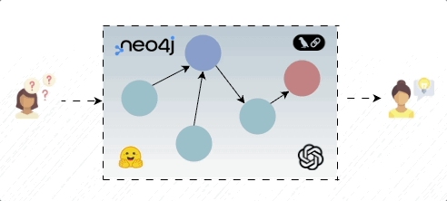

# 🕸️ GraphRAG Tutorial — Neo4j + LLMs

<p align="center">
  
</p>

*A minimal end-to-end tutorial to build a knowledge-graph-powered RAG using Neo4j and OpenAI.*


[](#)

[](#)

[](https://github.com/psf/black)

> Author: [Daniel Puente Viejo](https://www.linkedin.com/in/danielpuenteviejo/)

---

## 🎯 Objective

This repository shows how to **combine Neo4j + LLMs** to enable **reasoning-based retrieval** — going beyond vector similarity.  
We use a small **biomedical dataset** with drugs, diseases, biomarkers, and trials to compare **GraphRAG vs. classic RAG**.

---

## 🧠 Core Idea

Classical RAG retrieves text chunks by similarity.  
**GraphRAG** retrieves knowledge by relationships.

Example query:
> *“Which researchers in Spain studied immunotherapy drugs for breast cancer?”*

Classical RAG → unrelated text.  
GraphRAG → structured answer inferred from connected nodes.

---

## 🧩 Requirements
- Python used version: **3.12.11**
- Dependencies listed in `requirements.txt`
  ```python
  pip install -r requirements.txt
  ```
- `.env` file with the following variable:

  ```plaintext
  OPENAI_API_KEY=<your_api_key>
  NEO4J_URI=<your_neo4j_uri>
  NEO4J_USER=<your_neo4j_username>
  NEO4J_PASSWORD=<your_neo4j_password>
    ```


---

## 📃 License
This project is licensed under the MIT License - see the [LICENSE](LICENSE) file for details.
